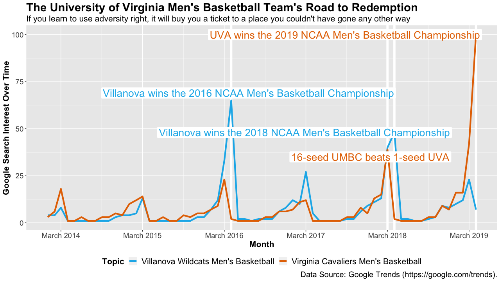

The UVA Men’s Basketball Team’s Road to Redemption
================

This document aims to create an original, expository graphic that
adheres to the techniques covered in
[Chapter 28](https://r4ds.had.co.nz/graphics-for-communication.html) of
R4DS. In particular, it aims to summarise its main finding with a BLUF
heading and subheading, have meaningful labels and axis breaks, include
a caption that clearly and completely captures the data being analyzed,
use the grammar of graphics in a fluent manner, and force the reader to
notice an unexpected phenomenon.

Regarding the last of these stated objectives, the visualization shows
that the quote Tony Bennett told his team all season long rang true: “If
you learn to use adversity right, it will buy you a ticket to a place
you couldn’t have gone any other way.” As of April 16, 2019, search
interest for the team in April 2019 is more than 2.5 times as popular as
it was when the team lost to UMBC in historic fashion in March of 2018.
This level of search interest might surprise critics, who claimed the
team’s style of play was boring to watch. Furthermore, search interest
for the team in April 2019 is around 155 percent higher than it was for
the Villanova men’s basketball team when Villanova won the NCAA Men’s
Basketball Championship in 2016. The additional popularity that the UVA
men’s basketball team received captures not only how exciting the
finishes to their games were, but (arguably) also how meaningful their
road to redemption was.

Begin by loading the libraries needed to run this script.

``` r
library(tidyverse)
library(scales)
library(lubridate)
library(gtrendsR)
library(ggrepel)
library(here)
```

If printing data to the console has been throwing you a warning that
‘along’ is being autocompleted as ‘along.with’, you might want to
toggle `warnPartialMatchArgs` off. When the next version of R is
released, the bug causing this warning will be fixed. For now, you can
toggle `warnPartialMatchArgs` off with:

``` r
options(warnPartialMatchArgs = FALSE)
```

For reproducibility purposes, create subfolders, named with today’s
date, to store data and output from this analysis in.

``` r
dir.create(here("11_reproducibility", "data"))
dir.create(here("11_reproducibility", "data", today()))
dir.create(here("11_reproducibility", "output"))
dir.create(here("11_reproducibility", "output", today()))
```

Again for reproducibility purposes, set a seed with the `set.seed()`
function to specify R’s random number generator (RNG) state for random
number generation. Setting a seed will ensure that the `gtrends()`
function from the gtrendsR package will pull the same data from the
Google Trends API time and again (within a given day). The following
pipe pulls search interest data for the University of Virginia and
Villanova men’s basketball teams from January 1, 2014 to April 13, 2019
and wrangles these data into a tibble with variables for month, keyword,
and search interest.

``` r
set.seed(7140)
gtrends(
   keyword = c(URLdecode("%2Fm%2F026jxvv"), URLdecode("%2Fm%2F02pjzvh")),
   geo = "US",
   time = "2014-01-01 2019-04-13"
) %>% 
   .[["interest_over_time"]] %>% 
   as_tibble() %>% 
   mutate(
      search_interest = case_when(hits == "<1" ~ 0, TRUE ~ as.numeric(hits)),
      keyword = case_when(
         keyword == URLdecode("%2Fm%2F026jxvv") ~ 
            "Virginia Cavaliers Men's Basketball",
         keyword == URLdecode("%2Fm%2F02pjzvh") ~ 
            "Villanova Wildcats Men's Basketball"
      ) 
   ) %>% 
   select(month = date, keyword, search_interest) ->
   interest
```

Using the `write_csv()` function, let’s save `interest` to a csv file in
the subfolder named after today’s date, which we created in a data
subfolder, so we can keep a record of the data we used for this analysis
and reproduce it accordingly.

``` r
write_csv(
   x    = interest, 
   path = here(
      "11_reproducibility",
      "data",
      today(),
      "road-to-redemption.csv"
   )
)
```

There are four big events we might want to call attention to in the
data. In April of 2016 and 2018, the Villanova men’s basketball team won
the NCAA Men’s Basketball Championship. We can use search interest for
the Villanova men’s basketball team during these months as points of
comparison for the University of Virginia’s men’s basketball team’s
search interest in April of 2019, when they won the NCAA Men’s
Basketball Championship. 🎉 Another relevant point of comparison occurred
in March of 2017 when the 1-seed University of Virginia’s men’s
basketball team lost to 16-seed UMBC. 👎

Using a technique discussed in the [annotations section of
Chapter 28](https://r4ds.had.co.nz/graphics-for-communication.html#annotations)
of R4DS, we can create a tibble with annotations for these big events
and use it to annotate the visualization being created in the subsequent
code chunk.

``` r
interest %>% 
   mutate(
      annotation = case_when(
         month == ymd("2016-04-01") & 
            keyword == "Villanova Wildcats Men's Basketball" ~
            "Villanova wins the 2016 NCAA Men's Basketball Championship",
         month == ymd("2018-03-01") & 
            keyword == "Virginia Cavaliers Men's Basketball" ~
            "16-seed UMBC beats 1-seed UVA",
         month == ymd("2018-04-01") & 
            keyword == "Villanova Wildcats Men's Basketball" ~
            "Villanova wins the 2018 NCAA Men's Basketball Championship",
         month == ymd("2019-04-01") & 
            keyword == "Virginia Cavaliers Men's Basketball" ~
            "UVA wins the 2019 NCAA Men's Basketball Championship"
      )
   ) %>% 
   filter(!is.na(annotation)) ->
   big_event
```

With `interest` and `big_event`, we can now create a visualization of
the University of Virginia men’s basketball team’s road to redemption.

``` r
interest %>% 
   ggplot(aes(x = month, y = search_interest, color = keyword)) +
   # Annotate where Villanova wins the 2016 NCAA Men's Basketball Championship. 
   geom_vline(
      xintercept = as.POSIXct("2016-04-01"), 
      size = 2, 
      color = "white"
   ) +
   # Annotate where 16-seed UMBC beats 1-seed UVA.
   geom_vline(
      xintercept = as.POSIXct("2018-03-01"), 
      size = 2, 
      color = "white"
   ) +
   # Annotate where Villanova wins the 2018 NCAA Men's Basketball Championship.
   geom_vline(
      xintercept = as.POSIXct("2018-04-01"), 
      size = 2, 
      color = "white"
   ) +
   # Annoatate where UVA wins the 2019 NCAA Men's Basketball Championship.
   geom_vline(
      xintercept = as.POSIXct("2019-04-01"), 
      size = 2, 
      color = "white"
   ) +
   # Add lines to the graph to capture each team's monthly search interest.
   geom_line(size = 1.5) +
   # Change the colors of the lines to match the universities' team colors.
   scale_color_manual(values = c("#13B5EA", "#E57200")) +
   # Annotate the graph with the events documented in the big_event tibble.
   ggrepel::geom_label_repel(
      aes(label = annotation), 
      face = "bold",
      size = 7,
      data = big_event,
      label.size = 0,
      segment.color = NA,
      show.legend = FALSE
   ) +
   # Make the x-axis breaks and labels meaningful by focusing on the month of 
   # March.
   scale_x_datetime(
      breaks = seq(as.POSIXct("2014-03-01"), as.POSIXct("2019-03-01"), "year"),
      date_labels = "%B %Y"
   ) +
   # Adjust the size of the text and move the legend to underneath the plot.
   theme(
      plot.title      = element_text(size = 22, face = "bold"), 
      plot.subtitle   = element_text(size = 16),
      axis.title      = element_text(size = 16, face = "bold"),
      axis.text       = element_text(size = 14), 
      legend.title    = element_text(size = 16, face = "bold"),
      legend.text     = element_text(size = 16), 
      plot.caption    = element_text(size = 15), 
      legend.position = "bottom"
   ) +
   # Add a BLUF title and subtitle as well as meaningful labels and a caption.
   labs(
      title    = "The University of Virginia Men's Basketball Team's Road to Redemption",
      subtitle = "If you learn to use adversity right, it will buy you a ticket to a place you couldn't have gone any other way",
      x        = "Month",
      y        = "Google Search Interest Over Time",
      color    = "Topic",
      caption  = "Data Source: Google Trends (https://google.com/trends)."
   )
```



Finally, using the `ggsave()` function, let’s save the visualization to
a pdf file in the subfolder named after today’s date, which we created
in an output subfolder, so we can keep a record of the visualization
this analysis created and reproduce it accordingly.

``` r
ggsave(
   filename = here(
      "11_reproducibility", 
      "output",
      today(),
      "road-to-redemption-visualization.pdf"
   ), 
   width = 12.43,
   height = 7,
   units = "in"
)
```
